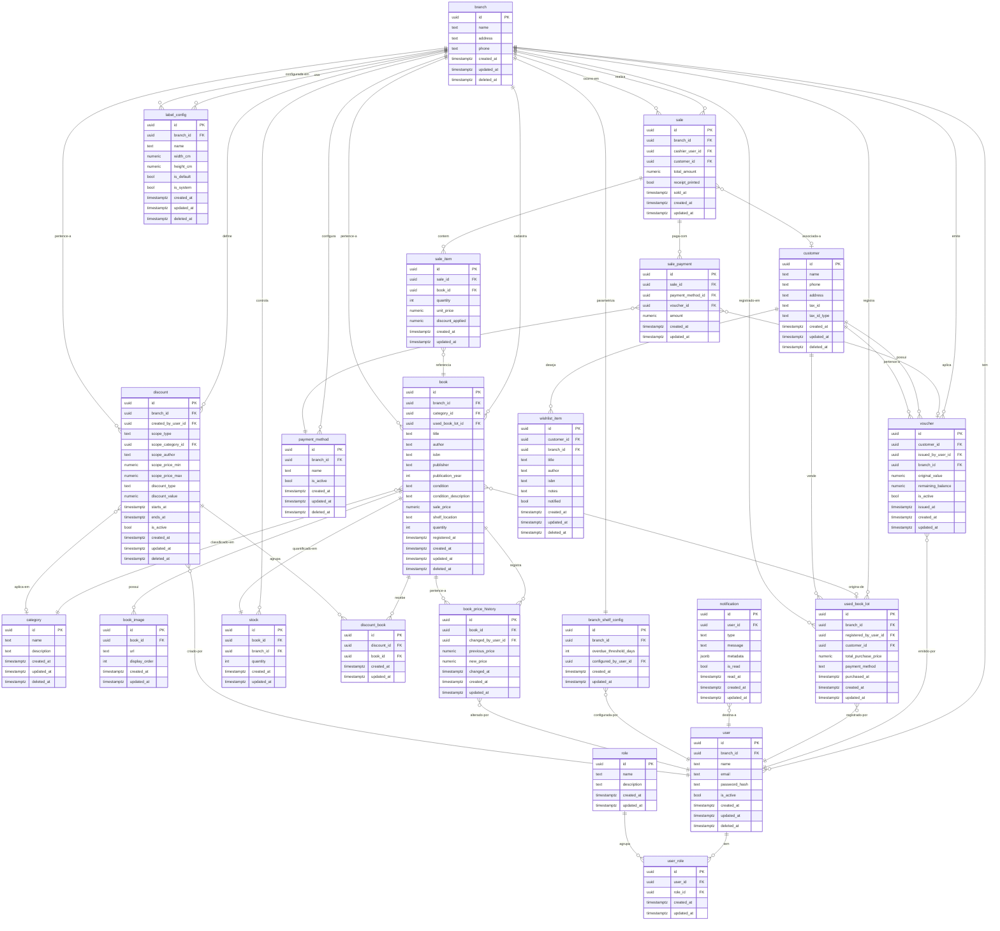

# Modelagem de Dados

**Estado da entrega:** Rascunho

Feature de infraestrutura — não é uma feature de negócio.

---

## Bloco 1 — Glossário de dados (linguagem acessível)

### branch (Filial)

Representa uma loja física da rede de livrarias. Cada filial tem seu próprio estoque, seus próprios usuários e suas próprias configurações (como o prazo de alerta de tempo de prateleira). Toda operação do sistema — vendas, cadastro de livros, descontos — está vinculada a uma filial específica.

### user (Usuário)

É um funcionário que acessa o sistema. Cada usuário pertence a uma filial (exceto o Administrador, que acessa todas). Um mesmo funcionário pode exercer mais de um papel: por exemplo, ser Catalogador e Caixa ao mesmo tempo. Armazena e-mail, senha (hash) e nome.

### role (Perfil de acesso)

Representa os quatro papéis fixos do sistema: Administrador, Gerente, Catalogador e Caixa. Não é possível criar perfis personalizados. Os perfis determinam o que cada usuário pode fazer no sistema.

### user_role (Vínculo usuário–perfil)

Tabela de ligação que registra quais perfis um usuário possui. Como um usuário pode ter vários perfis, essa tabela existe para representar esse relacionamento de muitos para muitos entre usuários e perfis.

### book (Livro)

É o registro central de um livro no sistema. Armazena título, autor, ISBN, editora, ano, gênero/categoria, condição (novo ou usado), descrição do estado de conservação (obrigatória para usados), preço de venda, localização física na prateleira e o contador de tempo em prateleira. Livros novos compartilham um registro por título com controle de quantidade. Cada exemplar usado tem seu próprio registro individual.

### book_image (Imagem do livro)

Guarda as imagens associadas a um livro — até 10 por registro. Cada imagem tem uma URL de armazenamento e uma ordem de exibição. Serve para mostrar o estado físico do livro ao cliente no momento da consulta no PDV.

### book_price_history (Histórico de preço)

Toda vez que o preço de venda de um livro é alterado, o sistema registra automaticamente: o preço anterior, o novo preço, quando a alteração ocorreu e quem a fez. Esse histórico é visível apenas para Gerente e Administrador e permite auditar variações de preço ao longo do tempo.

### stock (Estoque)

Controla a quantidade disponível de um livro em uma filial específica. Como o estoque não é compartilhado entre filiais, cada filial tem seu próprio registro de quantidade para cada livro. Para livros usados (registro individual), a quantidade é sempre 0 ou 1.

### category (Categoria/Gênero)

Representa as categorias de livros (ficção, romance, técnico, infantil etc.). É usada no cadastro do livro, na etiqueta impressa, e como escopo de desconto. Facilita a navegação e os filtros de busca.

### discount (Desconto)

Criado pelo Gerente, um desconto pode afetar um livro específico, uma categoria inteira, um autor ou uma faixa de preço. Pode ser um percentual ou um valor fixo em reais. Pode ter data/hora de início e fim. A regra de negócio garante que um livro não tenha mais de um desconto ativo ao mesmo tempo.

### discount_book (Vínculo desconto–livro)

Tabela de ligação usada quando um desconto é do tipo "livros individuais selecionados". Registra quais livros específicos fazem parte daquele desconto.

### payment_method (Método de pagamento)

Lista os métodos de pagamento disponíveis em uma filial (ex.: dinheiro, cartão de crédito, PIX, débito). Cada filial pode ter seus próprios métodos configurados pelo Gerente.

### sale (Venda)

Registra uma transação de venda realizada no PDV. Uma venda pertence a uma filial e pode ser associada a um cliente (opcional). Guarda o valor total, se foi emitido cupom físico e quando ocorreu. O estoque é deduzido automaticamente ao finalizar a venda.

### sale_item (Item da venda)

Representa cada livro incluído em uma venda. Guarda o preço unitário no momento da venda (pois o preço pode mudar depois) e o desconto aplicado naquele momento. Uma venda pode ter vários itens.

### sale_payment (Pagamento da venda)

Como uma venda pode ser paga com múltiplos métodos ao mesmo tempo (ex.: parte em dinheiro, parte no cartão), esta tabela registra cada método e o valor correspondente dentro de uma mesma venda.

### voucher (Vale-crédito / Voucher de troca)

Emitido pelo Gerente quando um cliente traz livros usados para troca. O voucher tem um valor acordado, sem prazo de validade, e pode ser usado parcialmente — o saldo remanescente fica preservado para compras futuras. Está vinculado a um cliente cadastrado.

### used_book_lot (Lote de compra de livros usados)

Registra a compra de um lote de livros usados de um cliente, com o valor total pago (em dinheiro ou PIX). Após o registro do lote, cada livro é cadastrado individualmente no sistema. Serve como entrada de inventário.

### customer (Cliente)

Armazena os dados dos clientes da loja: nome, telefone, endereço, CPF ou CNPJ (coletado para futura emissão de NF-e). Um cliente pode ter uma lista de desejos com livros que ainda não estão em estoque.

### wishlist_item (Item da lista de desejos)

Representa o interesse de um cliente por um livro específico que não está em estoque. Quando o livro é cadastrado no sistema, uma notificação é gerada automaticamente para o Gerente e o Caixa da filial.

### notification (Notificação in-app)

Registra notificações geradas pelo sistema para usuários específicos. Pode ser disparada pela chegada de um livro da lista de desejos ou por um livro que ultrapassou o tempo de prateleira configurado. O usuário pode marcar a notificação como lida/dispensada.

### label_config (Configuração de etiqueta)

Armazena os tamanhos de etiqueta configurados para impressão em folha A4 adesiva (ex.: 5 cm × 10 cm). Inclui configurações padrão do sistema e configurações personalizadas criadas pelos usuários. Cada etiqueta impressa contém código de barras, preço e categoria.

### branch_shelf_config (Configuração de tempo de prateleira por filial)

Armazena o prazo (em dias) configurado pelo Gerente ou Administrador para alertas de tempo de prateleira em cada filial. Quando um livro ultrapassa esse prazo sem ser vendido, uma notificação é gerada para o Gerente.

---

## Bloco 2 — Diagrama ER (Mermaid)

---

## Decisões e justificativas de modelagem

**Entidade `book` unifica novos e usados:** A descrição define que livros novos usam controle por quantidade e usados têm registro individual. A coluna `condition` (`new` / `used`) junto com a regra de `quantity` (sempre 1 para usados) unifica os dois casos em uma única tabela, evitando duplicação de atributos e simplificando buscas, histórico de preços e wishlist.

**Entidade `stock` separada de `book`:** Embora para livros usados o estoque seja trivial (0 ou 1), a separação entre `book` e `stock` mantém a 3FN e isola a lógica de controle por filial. O campo `quantity` em `book` é mantido como cache para leitura rápida no PDV; `stock` é a fonte de verdade.

**Campo `scope_type` em `discount`:** Os quatro escopos de desconto (livro individual, categoria, autor, faixa de preço) são representados por um único campo discriminador `scope_type` com campos opcionais correspondentes (`scope_category_id`, `scope_author`, `scope_price_min`, `scope_price_max`, `discount_book`). Isso evita quatro tabelas separadas e mantém a consulta centralizada. Uma constraint `CHECK` por scope_type garantirá consistência.

**Tabela `sale_payment` com referência opcional a `voucher`:** O voucher é um método de pagamento especial (sem tabela `payment_method` correspondente), por isso possui coluna própria `voucher_id` nullable em `sale_payment`. Quando `voucher_id` é preenchido, `payment_method_id` pode ser nulo, e vice-versa.

**Campo `payment_method` textual em `used_book_lot`:** A compra de lote de usados aceita apenas dinheiro ou PIX (regra de negócio fixa), portanto um `text` com constraint `CHECK ('cash', 'pix')` é suficiente, sem necessidade de FK para a tabela `payment_method`.

**`wishlist_item` armazena título/autor/ISBN como texto livre:** A lista de desejos representa interesse em livros que ainda não existem no catálogo. Por isso, os campos são texto livre em vez de FK para `book`. Quando o livro for cadastrado, a correspondência é feita por ISBN ou título/autor, e a notificação é disparada.

**`notification.metadata` como `jsonb`:** O conteúdo das notificações varia por tipo (chegada de livro da wishlist, tempo de prateleira excedido). O campo `jsonb` permite armazenar dados contextuais específicos de cada tipo sem criar múltiplas colunas nullable ou tabelas polimórficas.

**`branch_shelf_config` como tabela separada (1:1 com `branch`):** Separada de `branch` para manter o princípio de responsabilidade única e facilitar auditoria de alterações de configuração (quem alterou, quando).

---

## Quem pode acessar

N/A — feature de infraestrutura

## Fora de escopo

N/A
