# Data Model — POC Journey (Avaliação de Desempenho)

**Version:** 2026-05-14
**Status:** Draft

---

## Bloco 1 — Glossário de dados

### Tabelas existentes (referência)

**`users`**
Representa cada pessoa cadastrada no sistema. Armazena dados de identidade (nome, login, e-mail), o papel funcional dentro do processo (Colaborador, PDM, Calibrador, BP, Admin, Governança), o nível de senioridade no mapa de cargos, e referências a quem é o PDM e BP responsáveis por essa pessoa. Relaciona-se com `area` (onde a pessoa está lotada), com `cycle_subject` (como avaliada), com `cycle_evaluator` (como avaliadora), e com `calibration_session_participant` (como participante de calibração).

**`area`**
Representa a unidade organizacional (região + growth unit) à qual um colaborador pertence. Relaciona-se com `users`.

**`permission` / `user_permission`**
Controle granular de permissões por usuário, independente do role. Relaciona-se com `users`.

---

### Ciclos (CF e PR)

**`cycle`**
Tabela unificada para ciclos de Continuous Feedback e Performance Review. O campo `cycle_type` distingue o tipo (CF ou PR). Campos exclusivos de CF (`trigger_type`, `quarter`, `is_blackout`, `validation_deadline`) ficam nulos em ciclos PR; o campo `name` fica nulo em ciclos CF. Um ciclo CF pode ter várias sujeitas diretas; um ciclo PR organiza sujeitas em grupos por quarter. Relaciona-se com `cycle_subject` e `pr_cycle_group`.

**`cycle_subject`**
Tabela unificada para a sujeita (colaboradora avaliada) em qualquer ciclo, CF ou PR. Registra o status individual, referência ao ciclo e ao usuário avaliado. Campos exclusivos de CF (`validation_deadline`, `closed_at`, `closed_by`) ficam NULL em PR; campos exclusivos de PR (`cycle_group_id`, `allocation_model`, `submitted_for_calibration_at`) ficam NULL em CF. Relaciona-se com `cycle`, `pr_cycle_group`, `users`, `cycle_evaluator`, `cycle_self_evaluation`, `cycle_ai_summary`, `pr_pdm_assessment`, `pr_peer_response`, `calibration_item`, `pr_calibration_result` e `pr_debriefing`.

**`cycle_evaluator`**
Tabela unificada para avaliadores de qualquer ciclo (CF ou PR). Indica o tipo (SELF, PDM, PEER), se é obrigatório, status de resposta e quando respondeu. O limite de 10 convidados é controlado aqui. Relaciona-se com `cycle_subject`, `users`, `cf_response` e `pr_peer_response`.

**`cf_response`**
Armazena a resposta de um avaliador sobre a sujeita em um ciclo de CF. Texto livre — CF não tem escala numérica por dimensão. Anonimização (mínimo 3 respondentes) aplicada na camada de serviço. Relaciona-se com `cycle_evaluator`.

**`cycle_self_evaluation`**
Tabela unificada para a autoavaliação da sujeita em qualquer ciclo. Em CF: campo `content` (texto livre). Em PR: campos `d1_score`, `d1_comment`, `d2_score`, `d2_comment`, `d3_score`, `d3_comment` (nota 1–4 + comentário). Os campos do tipo oposto ficam NULL. A autoavaliação não conta para a nota final. Relaciona-se com `cycle_subject`.

**`cycle_ai_summary`**
Tabela unificada para o resumo gerado pela IA após o encerramento da coleta. Em PR inclui `coherence_analysis` (avaliação de coerência entre nota e comentário); em CF esse campo fica NULL. Aprovação obrigatória antes do registro oficial. Relaciona-se com `cycle_subject` e `users` (quem aprovou).

---

### Performance Review — grupos e sujeitas

**`pr_cycle_group`**
Representa um dos 4 grupos de colaboradores dentro de um ciclo de PR. Registra o quarter em que roda (1 a 4), as datas de início e fim, e o status. Os colaboradores são distribuídos nesses grupos pelo Admin. Relaciona-se com `cycle` (via `cycle_id`) e `cycle_subject`.

**`pr_peer_response`**
Armazena a avaliação de um par sobre a sujeita nas 3 dimensões (D1, D2, D3): nota (1–4) e comentário por dimensão. Mantida separada de `cf_response` pois tem estrutura distinta (nota obrigatória + 3 dimensões vs. texto livre). Relaciona-se com `cycle_evaluator`.

**`pr_pdm_assessment`**
Armazena a avaliação formal do PDM sobre a sujeita nas 3 dimensões (D1, D2, D3): nota (1–4) e comentário obrigatório por dimensão. Também registra o ajuste de score final (±1) com justificativa, o contexto/prework escrito pelo PDM antes da calibração, e o status de submissão para calibração. É a avaliação que vai para a sessão de calibração. Relaciona-se com `cycle_subject` e `users` (o PDM avaliador).

**`pr_ai_alert`**
Registra alertas gerados pela IA durante o preenchimento da avaliação (resposta com detalhes insuficientes, cobertura abaixo de 70% das skills/dimensões). Relaciona-se com `pr_pdm_assessment` e `pr_peer_response` (via referência polimórfica resolvida por colunas separadas).

---

### Calibração

**`calibration_session`**
Representa uma sessão de calibração gerada pelo sistema a partir da agenda do Admin. Armazena a data/hora agendada, o calibrador responsável pela decisão final, e o status da sessão (agendada, em andamento, encerrada). Uma sessão pode cobrir vários colaboradores. Relaciona-se com `cycle` (via `cycle_id`), `calibration_session_participant` e `calibration_item`.

**`calibration_session_participant`**
Registra os participantes convidados para uma sessão de calibração (PDMs, BPs, membros de governança). Indica o papel na sessão e se confirmou presença. Relaciona-se com `calibration_session` e `users`.

**`calibration_item`**
Representa um colaborador dentro de uma sessão de calibração. Armazena o posicionamento Nine Box proposto pelo PDM (eixo X e Y), o score final decidido pelo Calibrador (D1, D2, D3), e o status de conclusão desse item na sessão. O Calibrador é o único que pode editar o score final. Relaciona-se com `calibration_session`, `cycle_subject` e `users` (o Calibrador que fechou).

**`pr_calibration_result`**
Armazena o resultado oficial pós-calibração de uma sujeita: os scores finais D1/D2/D3, a posição no Nine Box, e referência ao item de calibração que gerou esse resultado. É o registro permanente e auditável do resultado do PR. Relaciona-se com `cycle_subject` e `calibration_item`.

---

### Devolutiva

**`pr_debriefing`**
Registra a devolutiva conduzida pelo PDM com a sujeita após a calibração. Armazena o status (pendente, agendada, realizada), a data de realização, e um comentário/notas do PDM sobre a conversa. É o registro formal de que a comunicação do resultado ocorreu. Relaciona-se com `cycle_subject` e `users` (o PDM que conduziu).

---

### Configuração e histórico

**`cycle_blackout`**
Registra os períodos de blackout configurados para um ciclo de PR. Durante o blackout, novos CFs não podem ser abertos para os colaboradores do grupo afetado. Relaciona-se com `pr_cycle_group`.

**`ona_suggestion`**
Registra as sugestões de avaliadores geradas pelo ONA (simulado com mock no MVP) para uma sujeita em um ciclo (CF ou PR). Armazena os usuários sugeridos e o motivo simulado da sugestão. Serve de base para a lista inicial que o colaborador valida. Relaciona-se com `users` (sujeita e sugerido) e usa referência ao ciclo subject por tipo.

---

## Bloco 2 — Diagrama ER

```mermaid
erDiagram

  %% ──────────────────────────────────────────
  %% TABELAS EXISTENTES
  %% ──────────────────────────────────────────

  area {
    uuid id PK
    text region
    text growth_unit
    timestamptz created_at
    timestamptz updated_at
    uuid created_by
    uuid updated_by
  }

  users {
    uuid id PK
    text name
    text login
    text email
    text role
    text position_map
    date admission_date
    boolean active
    uuid area_id FK
    uuid pdm_id FK
    uuid bp_id FK
    timestamptz created_at
    timestamptz updated_at
    uuid created_by
    uuid updated_by
    timestamptz deleted_at
  }

  permission {
    uuid id PK
    text description
    timestamptz created_at
    timestamptz updated_at
    uuid created_by
    uuid updated_by
  }

  user_permission {
    uuid id PK
    uuid user_id FK
    uuid permission_id FK
    timestamptz created_at
    timestamptz updated_at
    uuid created_by
    uuid updated_by
  }

  %% ──────────────────────────────────────────
  %% CICLO (CF e PR unificados)
  %% ──────────────────────────────────────────

  cycle {
    uuid id PK
    text cycle_type
    integer year
    text status
    text name
    text trigger_type
    integer quarter
    boolean is_blackout
    timestamptz validation_deadline
    timestamptz collection_start_at
    timestamptz collection_deadline
    timestamptz closed_at
    uuid created_by FK
    timestamptz created_at
    timestamptz updated_at
    uuid updated_by
    timestamptz deleted_at
  }

  cycle_subject {
    uuid id PK
    uuid cycle_id FK
    uuid cycle_group_id FK
    uuid subject_user_id FK
    text status
    text allocation_model
    timestamptz validation_deadline
    timestamptz collection_start_at
    timestamptz closed_at
    uuid closed_by FK
    timestamptz submitted_for_calibration_at
    timestamptz created_at
    timestamptz updated_at
    uuid created_by
    uuid updated_by
    timestamptz deleted_at
  }

  cycle_evaluator {
    uuid id PK
    uuid cycle_subject_id FK
    uuid evaluator_user_id FK
    text evaluator_type
    text status
    boolean is_mandatory
    timestamptz responded_at
    timestamptz created_at
    timestamptz updated_at
    uuid created_by
    uuid updated_by
    timestamptz deleted_at
  }

  cf_response {
    uuid id PK
    uuid cycle_evaluator_id FK
    text content
    timestamptz submitted_at
    timestamptz created_at
    timestamptz updated_at
    uuid created_by
    uuid updated_by
  }

  cycle_self_evaluation {
    uuid id PK
    uuid cycle_subject_id FK
    text content
    integer d1_score
    text d1_comment
    integer d2_score
    text d2_comment
    integer d3_score
    text d3_comment
    timestamptz submitted_at
    timestamptz created_at
    timestamptz updated_at
    uuid created_by
    uuid updated_by
  }

  cycle_ai_summary {
    uuid id PK
    uuid cycle_subject_id FK
    text summary_text
    text coherence_analysis
    text ai_model_version
    text status
    uuid approved_by FK
    timestamptz approved_at
    timestamptz generated_at
    timestamptz created_at
    timestamptz updated_at
    uuid created_by
    uuid updated_by
  }

  %% ──────────────────────────────────────────
  %% CICLO PR — grupos
  %% ──────────────────────────────────────────

  pr_cycle_group {
    uuid id PK
    uuid cycle_id FK
    text group_label
    integer quarter
    timestamptz blackout_start_at
    timestamptz blackout_end_at
    timestamptz start_at
    timestamptz end_at
    text status
    timestamptz created_at
    timestamptz updated_at
    uuid created_by
    uuid updated_by
    timestamptz deleted_at
  }

  pr_peer_response {
    uuid id PK
    uuid cycle_evaluator_id FK
    integer d1_score
    text d1_comment
    integer d2_score
    text d2_comment
    integer d3_score
    text d3_comment
    timestamptz submitted_at
    timestamptz created_at
    timestamptz updated_at
    uuid created_by
    uuid updated_by
  }

  pr_pdm_assessment {
    uuid id PK
    uuid cycle_subject_id FK
    uuid pdm_user_id FK
    integer d1_score
    text d1_comment
    integer d2_score
    text d2_comment
    integer d3_score
    text d3_comment
    integer score_adjustment
    text score_adjustment_reason
    text prework_context
    text status
    timestamptz submitted_at
    timestamptz created_at
    timestamptz updated_at
    uuid created_by
    uuid updated_by
  }

  pr_ai_alert {
    uuid id PK
    uuid pr_pdm_assessment_id FK
    uuid pr_peer_response_id FK
    text alert_type
    text alert_message
    text status
    timestamptz created_at
    timestamptz updated_at
    uuid created_by
    uuid updated_by
  }

  %% ──────────────────────────────────────────
  %% CALIBRAÇÃO
  %% ──────────────────────────────────────────

  calibration_session {
    uuid id PK
    uuid cycle_id FK
    uuid calibrator_user_id FK
    timestamptz scheduled_at
    timestamptz started_at
    timestamptz paused_at
    timestamptz closed_at
    text status
    timestamptz created_at
    timestamptz updated_at
    uuid created_by
    uuid updated_by
    timestamptz deleted_at
  }

  calibration_session_participant {
    uuid id PK
    uuid calibration_session_id FK
    uuid participant_user_id FK
    text role_in_session
    boolean confirmed_presence
    timestamptz created_at
    timestamptz updated_at
    uuid created_by
    uuid updated_by
  }

  calibration_item {
    uuid id PK
    uuid calibration_session_id FK
    uuid cycle_subject_id FK
    integer nine_box_x_proposed
    integer nine_box_y_proposed
    integer nine_box_x_final
    integer nine_box_y_final
    integer d1_score_final
    integer d2_score_final
    integer d3_score_final
    uuid closed_by FK
    timestamptz closed_at
    timestamptz last_saved_at
    text status
    timestamptz created_at
    timestamptz updated_at
    uuid created_by
    uuid updated_by
  }

  pr_calibration_result {
    uuid id PK
    uuid cycle_subject_id FK
    uuid calibration_item_id FK
    integer d1_score_final
    integer d2_score_final
    integer d3_score_final
    integer nine_box_x
    integer nine_box_y
    timestamptz created_at
    timestamptz updated_at
    uuid created_by
    uuid updated_by
  }

  %% ──────────────────────────────────────────
  %% DEVOLUTIVA
  %% ──────────────────────────────────────────

  pr_debriefing {
    uuid id PK
    uuid cycle_subject_id FK
    uuid pdm_user_id FK
    text status
    timestamptz scheduled_at
    timestamptz conducted_at
    text notes
    timestamptz created_at
    timestamptz updated_at
    uuid created_by
    uuid updated_by
  }

  %% ──────────────────────────────────────────
  %% BLACKOUT E ONA
  %% ──────────────────────────────────────────

  cycle_blackout {
    uuid id PK
    uuid pr_cycle_group_id FK
    timestamptz starts_at
    timestamptz ends_at
    timestamptz created_at
    timestamptz updated_at
    uuid created_by
    uuid updated_by
  }

  ona_suggestion {
    uuid id PK
    uuid subject_user_id FK
    uuid suggested_user_id FK
    text cycle_type
    uuid cycle_subject_id
    text reason_mock
    timestamptz created_at
    timestamptz updated_at
    uuid created_by
    uuid updated_by
  }

  %% ──────────────────────────────────────────
  %% RELACIONAMENTOS
  %% ──────────────────────────────────────────

  area ||--o{ users : "lotação"
  users }o--o| users : "PDM de"
  users }o--o| users : "BP de"
  users ||--o{ user_permission : "possui"
  permission ||--o{ user_permission : "concedida via"

  cycle ||--o{ cycle_subject : "tem sujeitas"
  cycle ||--o{ pr_cycle_group : "tem grupos PR"
  pr_cycle_group ||--o{ cycle_subject : "agrupa sujeitas PR"
  pr_cycle_group ||--o{ cycle_blackout : "tem blackouts"
  cycle_subject }o--|| users : "avaliada"
  cycle_subject ||--o{ cycle_evaluator : "tem avaliadores"
  cycle_subject ||--o| cycle_self_evaluation : "tem autoavaliação"
  cycle_subject ||--o| cycle_ai_summary : "tem resumo IA"
  cycle_subject ||--o| pr_pdm_assessment : "tem avaliação PDM"
  cycle_subject ||--o| pr_calibration_result : "tem resultado calibração"
  cycle_subject ||--o| pr_debriefing : "tem devolutiva"
  cycle_evaluator }o--|| users : "avaliador"
  cycle_evaluator ||--o| cf_response : "responde CF"
  cycle_evaluator ||--o| pr_peer_response : "responde PR"
  cycle_ai_summary }o--o| users : "aprovado por"
  pr_pdm_assessment }o--|| users : "escrita pelo PDM"
  pr_pdm_assessment ||--o{ pr_ai_alert : "gera alertas IA"
  pr_peer_response ||--o{ pr_ai_alert : "gera alertas IA"

  cycle ||--o{ calibration_session : "tem sessões PR"
  calibration_session }o--|| users : "conduzida pelo Calibrador"
  calibration_session ||--o{ calibration_session_participant : "tem participantes"
  calibration_session ||--o{ calibration_item : "tem itens"
  calibration_session_participant }o--|| users : "participante"
  calibration_item }o--|| cycle_subject : "avalia sujeita"
  calibration_item }o--o| users : "fechado pelo Calibrador"
  pr_calibration_result }o--|| cycle_subject : "resultado de"
  pr_calibration_result }o--|| calibration_item : "origina de"

  ona_suggestion }o--|| users : "sujeita"
  ona_suggestion }o--|| users : "sugerido"
```



---

## Decisões de design

### Normalização e denormalização

- **`pr_calibration_result` denormaliza scores de `calibration_item`:** justificativa — `calibration_item` é um registro de sessão (pode ser reaberto/corrigido); `pr_calibration_result` é o resultado oficial imutável após fechamento. Mantemos os dois para separar a responsabilidade de "decisão de calibração" da "publicação do resultado".

- **`pr_ai_alert` com duas FKs opcionais (`pr_pdm_assessment_id` / `pr_peer_response_id`):** preferido a polimorfismo por colunas genéricas. Exatamente um dos dois será não-nulo por registro. Adicionar constraint `CHECK ((pr_pdm_assessment_id IS NULL) <> (pr_peer_response_id IS NULL))`.

- **Nine Box com colunas X/Y inteiras (1–3):** evita tabela auxiliar de mapeamento. X = HOW (D2+D3 combinado), Y = WHAT (D1). Valores 1, 2, 3 para baixo/médio/alto. Proposto e final ficam na `calibration_item`.

- **`ona_suggestion.cycle_subject_id` sem FK formal:** o ONA aponta para sujeitas de CF ou PR; manter como UUID sem FK e usar `cycle_type` ('CF'/'PR') para resolver na aplicação evita complexidade de FK polimórfica. Revisável na fase 2 com integração real.

- **`cycle` unificada (CF + PR):** tabela única com `cycle_type` (CF | PR). Campos exclusivos de CF ficam NULL em ciclos PR e vice-versa. CF não tem grupos — sujeitas entram diretamente em `cycle_subject` sem `cycle_group_id`. PR organiza sujeitas via `pr_cycle_group`.

- **`cycle_subject`, `cycle_evaluator`, `cycle_self_evaluation`, `cycle_ai_summary` unificadas:** estrutura idêntica ou quase idêntica entre CF e PR justifica tabela única. Campos exclusivos de um tipo ficam NULL. `cf_response` e `pr_peer_response` mantidas separadas por diferença estrutural fundamental (texto livre vs. 3 dimensões com nota obrigatória).

- **Autoavaliação em `cycle_self_evaluation`:** separa claramente o dado de "avaliador externo" do dado de "própria sujeita", facilita a regra de que autoavaliação não conta para nota final.

### Índices sugeridos

```sql
-- users
CREATE INDEX idx_users_area_id       ON users (area_id);
CREATE INDEX idx_users_pdm_id        ON users (pdm_id);
CREATE INDEX idx_users_bp_id         ON users (bp_id);
CREATE INDEX idx_users_role          ON users (role);
CREATE INDEX idx_users_active        ON users (active) WHERE active = true;

-- cycle
CREATE INDEX idx_cycle_type          ON cycle (cycle_type);
CREATE INDEX idx_cycle_status        ON cycle (status);
CREATE INDEX idx_cycle_year          ON cycle (year);

-- cycle_subject
CREATE INDEX idx_subject_cycle       ON cycle_subject (cycle_id);
CREATE INDEX idx_subject_group       ON cycle_subject (cycle_group_id);
CREATE INDEX idx_subject_user        ON cycle_subject (subject_user_id);
CREATE INDEX idx_subject_status      ON cycle_subject (status);

-- cycle_evaluator
CREATE INDEX idx_evaluator_subject   ON cycle_evaluator (cycle_subject_id);
CREATE INDEX idx_evaluator_user      ON cycle_evaluator (evaluator_user_id);
CREATE INDEX idx_evaluator_status    ON cycle_evaluator (status);

-- calibration_item
CREATE INDEX idx_cal_item_session    ON calibration_item (calibration_session_id);
CREATE INDEX idx_cal_item_subject    ON calibration_item (cycle_subject_id);
CREATE INDEX idx_cal_item_status     ON calibration_item (status);

-- pr_calibration_result
CREATE INDEX idx_cal_result_subject  ON pr_calibration_result (cycle_subject_id);

-- pr_debriefing
CREATE INDEX idx_debriefing_subject  ON pr_debriefing (cycle_subject_id);
CREATE INDEX idx_debriefing_status   ON pr_debriefing (status);

-- pr_ai_alert
CREATE INDEX idx_ai_alert_assessment ON pr_ai_alert (pr_pdm_assessment_id)
  WHERE pr_pdm_assessment_id IS NOT NULL;
CREATE INDEX idx_ai_alert_peer       ON pr_ai_alert (pr_peer_response_id)
  WHERE pr_peer_response_id IS NOT NULL;
```

### Soft delete

Tabelas com `deleted_at`: `users`, `cycle`, `cycle_subject`, `cycle_evaluator`, `pr_cycle_group`, `calibration_session`, `calibration_item`.

Tabelas sem `deleted_at` (registros imutáveis pós-criação): `cf_response`, `cycle_self_evaluation`, `cycle_ai_summary`, `pr_peer_response`, `pr_pdm_assessment`, `pr_ai_alert`, `pr_calibration_result`, `pr_debriefing`, `calibration_session_participant`, `cycle_blackout`, `ona_suggestion`.

### Enums (implementar como `text` com CHECK constraint ou tipo PostgreSQL)

```sql
-- users.role
CHECK (role IN ('COLABORADOR','PDM','CALIBRADOR','BP','ADMIN','GOVERNANÇA'))

-- users.position_map
CHECK (position_map IN ('INTERN','JUNIOR','MID_LEVEL','SENIOR','MANAGER',
                        'SENIOR_MANAGER','EXECUTIVE_MANAGER','EXECUTIVE_DIRECTOR',
                        'PARTNER','CEO'))

-- cycle.cycle_type
CHECK (cycle_type IN ('CF','PR'))

-- cycle.trigger_type (nullable — aplicável apenas quando cycle_type = 'CF')
CHECK (trigger_type IN ('QUARTERLY_AUTO','EVENT','MANUAL_PDM','MANUAL_SUBJECT'))

-- cycle.status / cycle_subject.status (CF)
CHECK (status IN ('DRAFT','VALIDATING_EVALUATORS','COLLECTING','CLOSED','CANCELLED'))

-- cycle_subject.status (PR)
CHECK (status IN ('PENDING','COLLECTING','READY_FOR_CALIBRATION','CALIBRATED','DEBRIEFED'))

-- cycle_evaluator.evaluator_type
CHECK (evaluator_type IN ('SELF','PDM','PEER'))

-- cycle_evaluator.status
CHECK (status IN ('PENDING','RESPONDED','SKIPPED'))

-- cycle_subject.allocation_model (nullable — PR only)
CHECK (allocation_model IN ('TEAM','STAFF_AUG','SDLC'))

-- pr_pdm_assessment.score_adjustment
CHECK (score_adjustment IN (-1, 0, 1))

-- calibration_session.status
CHECK (status IN ('SCHEDULED','IN_PROGRESS','PAUSED','CLOSED'))

-- calibration_item.status
CHECK (status IN ('PENDING','DRAFT','CONFIRMED'))

-- pr_debriefing.status
CHECK (status IN ('PENDING','SCHEDULED','CONDUCTED'))

-- cycle_ai_summary.status
CHECK (status IN ('PENDING_APPROVAL','APPROVED','REJECTED'))

-- pr_ai_alert.alert_type
CHECK (alert_type IN ('INSUFFICIENT_DETAIL','LOW_DIMENSION_COVERAGE','INCOHERENCE'))

-- pr_ai_alert.status
CHECK (status IN ('OPEN','DISMISSED','RESOLVED'))

-- ona_suggestion.cycle_type (referência leve, sem FK formal)
CHECK (cycle_type IN ('CF','PR'))

-- calibration_session_participant.role_in_session
CHECK (role_in_session IN ('PDM','CALIBRADOR','BP','GOVERNANÇA'))
```
